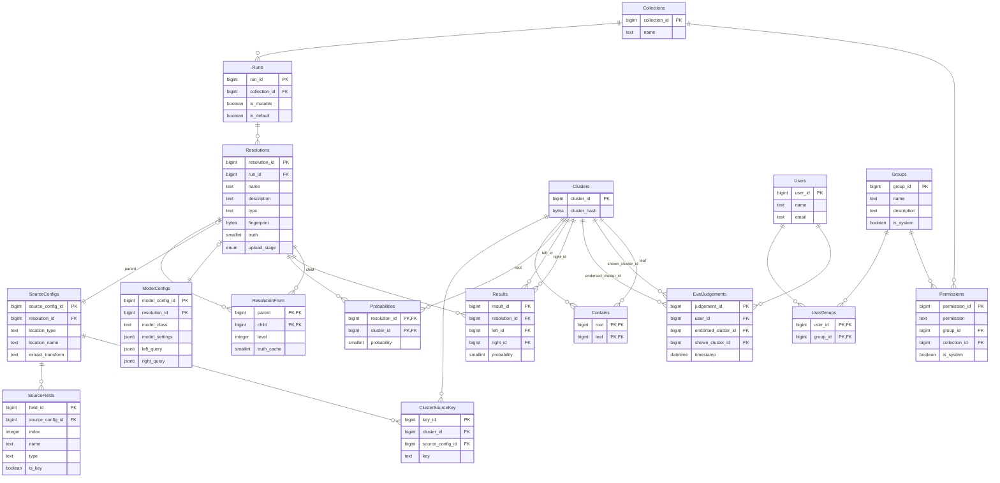

# PostgreSQL

A backend adapter for deploying Matchbox using PostgreSQL.

There are two graph-like trees in place here.

* In the resolution subgraph the tree is implemented as closure table, enabling quick querying of root to leaf paths at the cost of redundancy
* In the data subgraph the tree is implemented as a modified closure table which only stores the "root" and "leaf" relationships for each model
    * The leaf IDs
    * The model's proposed cluster IDs at that threshold -- the roots

::: matchbox.server.postgresql
    options:
        show_root_heading: true
        show_root_full_path: true
        members_order: source
        show_if_no_docstring: true
        docstring_style: google
        show_signature_annotations: true
        separate_signature: true
        show_submodules: true
        extra:
            show_root_docstring: true